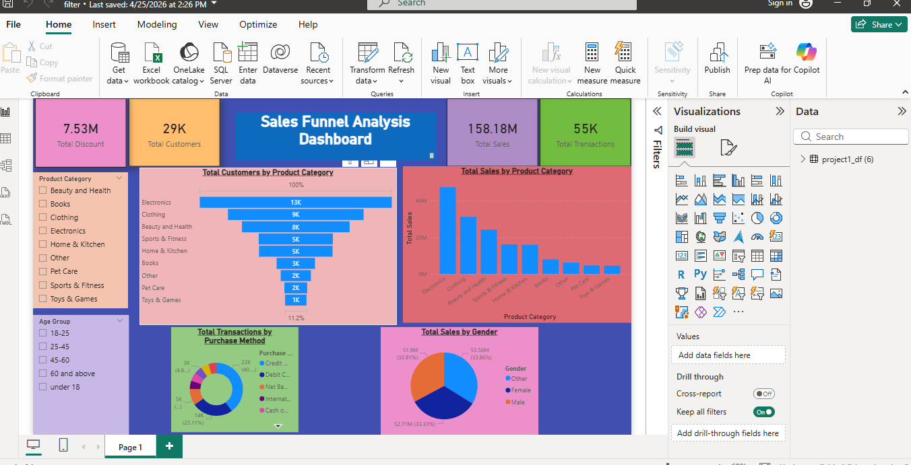
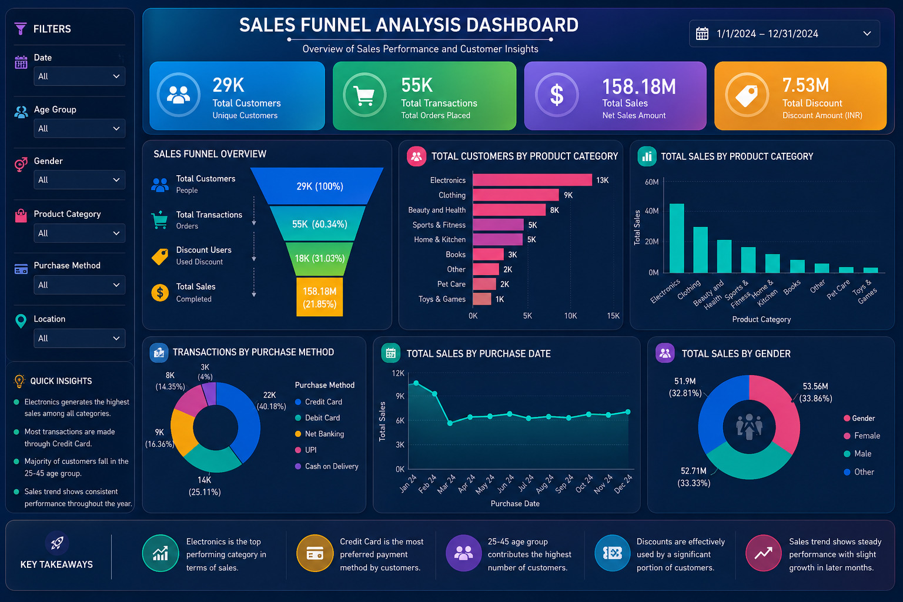

# Funnel Analysis Dashboard

## Overview
This dashboard analyzes the customer journey through different stages of the sales funnel.

## Funnel Stages
- Visit
- Sign Up
- Add to Cart
- Purchase

## Tools Used
- Power BI
- Excel / CSV

## Key Insights
- Highest drop-off occurs at checkout stage.
- Social media drives the most traffic.
- Conversion rate can be improved by reducing checkout friction.

## Output

